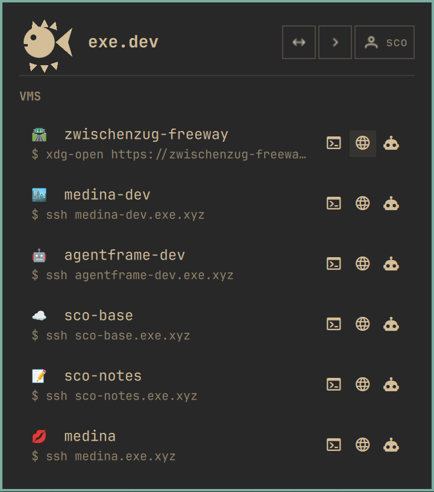

# exe.dev for Omarchy

A compact, keyboard-first Omarchy bar plugin for browsing and managing [exe.dev](https://exe.dev) VMs.

This is an independent community plugin. Its source lives at [github.com/sco/omarchy-exe](https://github.com/sco/omarchy-exe).



## Features

- Lists and manages VMs through exe.dev's HTTPS API
- Shows each VM's exe.dev emoji, name, and SSH destination
- Provides compact header shortcuts for Integrations, the SSH lobby, and Account
- Opens an SSH session in the configured Omarchy terminal
- Opens a VM's HTTPS URL
- Restarts a VM, copies its SSH destination, or creates a named VM with an initial Shelley prompt
- Refreshes whenever the panel opens and on a configurable interval (30 seconds by default)
- Mints a scoped 90-day API token through one interactive SSH authorization
- Stores the token in GNOME Keyring; it is never passed in process arguments

## Requirements

- OpenSSH for initial authorization and interactive VM sessions
- `curl` and `secret-tool` (both included with Omarchy)
- `wl-copy` for clipboard actions
- A current Omarchy shell with bar plugin support

## Installation

```bash
omarchy plugin add https://github.com/sco/omarchy-exe.git --enable
```

The `--enable` flag activates the plugin immediately after installation. Plugins run unsandboxed inside the Omarchy shell, so review the source before enabling it.

## First use

Open the panel and press `enter` when prompted. A terminal asks exe.dev to mint an API token scoped to `ls`, `new`, `restart`, and `whoami`, then stores it in GNOME Keyring. Its lifetime defaults to 90 days and is configurable before authorization. The token is read through `secret-tool` and sent to exe.dev in an HTTP authorization header; it is never placed in process arguments.

## Keyboard shortcuts

With the panel open:

- `j` / `k` or up/down: select a VM; selection starts on SSH
- right/left: move through SSH, Browser, and Shelley actions available for that VM
- `enter`: run the selected row or action
- `o`: open its HTTPS URL
- `r`: restart it
- `c`: copy its SSH destination
- `n`: open the new-VM form; enter an optional name and Shelley prompt
- `f`: refresh the list
- `esc`: close the panel

When no API token is available, press `o` to open exe.dev's email/passkey sign-in page instead.

Right-clicking the bar icon also refreshes the VM list.

## Configuration

`refreshIntervalSec` controls background refreshes. It defaults to 30 seconds and accepts values from 5 to 3600 seconds.

`tokenLifetimeDays` controls the lifetime requested when minting a new API token. It defaults to 90 days and accepts values from 1 to 365 days. Changing it does not alter a token that has already been minted.

## Updating and removal

```bash
omarchy plugin update sco.exe
omarchy plugin remove sco.exe
```

Removal deletes the installed plugin checkout. To revoke its API token locally, remove the `service=exe.dev, application=sco.exe` entry from GNOME Keyring. Token management is also available through exe.dev.

```bash
secret-tool clear service exe.dev application sco.exe
```

## Security

- The plugin runs unsandboxed inside the long-lived Omarchy shell, like every shell plugin.
- It executes `ssh`, `curl`, `secret-tool`, `wl-copy`, and `omarchy-launch-terminal` as the current user; it never requests elevated privileges or installs software.
- Its HTTPS API token is scoped to `ls`, `new`, `restart`, and `whoami`.
- The token is stored in GNOME Keyring and passed to `curl` through a header read from standard input, not through process arguments.
- VM names, prompts, and destinations are shell-quoted or passed as discrete process arguments before execution.
- Review updates before accepting them; `omarchy plugin update` displays the incoming diff.

## Design

The plugin follows Omarchy's current `bar-widget` conventions: `Panel.qml` is the entry point, `Service.qml` owns the backend processes, and the panel uses the shared `Panel`, `KeyboardPanel`, `PanelKeyCatcher`, and `CursorSurface` primitives.

`BlowfishIcon.qml` renders an original low-resolution mark from native QML geometry, following the built-in Tailscale and Dropbox icon pattern. The three header icons use minimal inline SVG paths derived from PrimeIcons; row actions use the same icon font as Omarchy's built-in panels. See [`THIRD_PARTY_LICENSES.md`](THIRD_PARTY_LICENSES.md).

## Documentation

- [exe.dev documentation](https://exe.dev/docs)
- [exe.dev documentation index for coding agents](https://exe.dev/llms.txt)
- [HTTPS API](https://exe.dev/docs/https-api.md)
- [API and CLI access](https://exe.dev/docs/api.md)
- [Shelley](https://exe.dev/docs/shelley/intro.md)
- [Omarchy plugin development guide](https://omarchyplugins.com/develop.html)

## TODOs

- Improve the GitHub description, homepage, social preview, and repository topics.
- Add and refine the draft script for a short hype video, then record it.

## License

MIT
